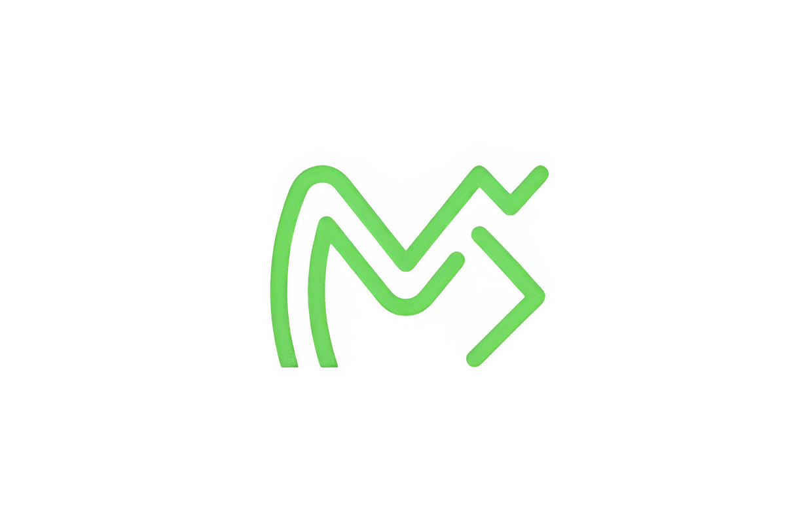

  
   
  
   

---
I'm a 3rd-year software engineering undergraduate who thrives at the intersection of digital and physical tech. Instead of just writing code that lives on a screen, I like building systems I can actually interact with—whether that's designing a sleek, responsive front-end or wiring up an ESP32 to automate my environment. 

### Current Focus

* **Building:** Exploring new concepts and working on fresh personal projects to push my technical limits.
* **Tinkering:** Smart Home Automation, prototyping custom microcontroller circuits, and fine-tuning lighting controls.
* **Learning:** Deepening my knowledge in modern full-stack development (React/Next.js) and experimenting with advanced IoT hardware.

### Tech Stack

**Languages**  

**Web Development**  

**Hardware & IoT**  

**Tools**  

### Connect

